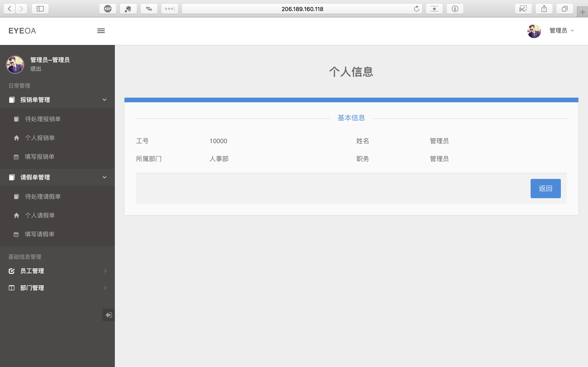
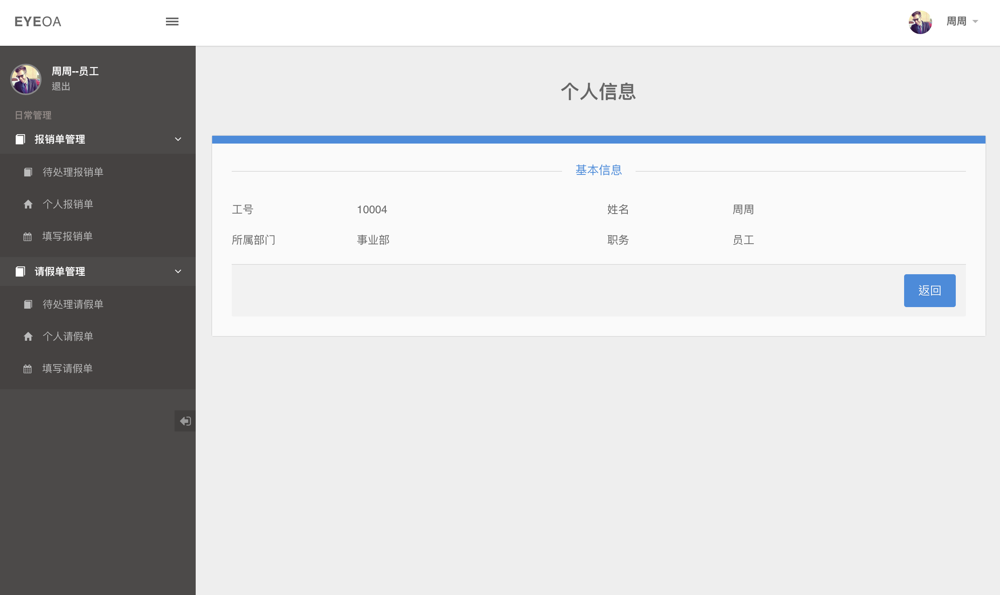

# OA_SSM
OA办公管理系统

## 功能
1. 部门信息管理
2. 员工信息管理
3. 报销单处理
4. 请假单处理

## 主要技术
1. Mysql
3. Spring MVC
4. Spring IOC
5. Mybatis + Spring 整合 
6. 声明式事务
7. Spring 标签库
8. Spring 拦截器

## 显示示例
1. 网站：[https://oa.imtt.me](https://oa.imtt.me)
2. 登陆信息
    - 员工账号：10004，密码：000000
    - 部门经理账号：10003，密码：000000
3. 管理员页面：
   非管理员页面：

## 其它
前台页面源码基于：[http://admindesigns.com/demos/absolute/1.1/dashboard.html](http://admindesigns.com/demos/absolute/1.1/dashboard.html)